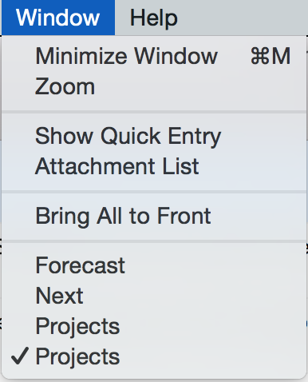

## Initial Email

**Subject:** Window titles for selected Projects or Contexts

Currently, when I select/open a Project or Context, the window title never changes from “Projects” or “Contexts”. I see some of the logic here — the title is always the name of the current perspective. But these aren’t focused perspectives so much as they are buckets, and it would be helpful if the window title changed to reflect a project being selected. That would help me with this problem which I run into often: I have two “Projects” windows open and don’t know which to choose.

## Auto reply

Your message has been assigned an ID of [OG #1276467].

## Human reply

Hi Chris,

Thanks for writing! I've filed a new feature request for this and included your example. We can't work every feature that our users suggest in, but we really appreciate them, and we can promise that each suggestion will be read and considered.

You probably already know this, but I thought I might as well mention that you can right-click on a project selection and choose "focus in new window" from the contextual menu. (Of course that doesn't help with contexts, though.)

If you have any other questions or suggestions, please don't hesitate to contact us!

Best regards,

Theo W.
Support
Omni Group

## My reply, 2016-02-04

Hi,

Do you have any update on this feature request?

Thanks,
Chris

## Human reply, 2016-02-04

Hello again, Chris!

Sorry, but I'm afraid I don't have any updates on the status of your feature request. It's not that we don't want to add this, but from a technical perspective it's unfortunately not as simple a change to make as it might perhaps seem. We're a rather small company, and in order to add it we would need to divert resources from other endeavors that in our estimation provide greater benefit for more users.

For example, Push syncing was also something that required a significant investment of limited engineering resources, but it directly benefits almost every single user of OmniFocus. Push syncing was added to the iOS app in 2.6 and the Mac app in version 2.4: <https://support.omnigroup.com/omnifocus-push-architecture/>

There's also the issue of bug fixes, which tend to take priority over feature requests. Not to mention that maintaining compatibility with all the latest and greatest OS changes from Apple requires a nontrivial application of engineering effort.

If you're interested in a fairly exhaustive list of the things we've been working on since you last emailed us, there's a relevant blog post here: <https://www.omnigroup.com/blog/looking-back-looking-ahead-2016-edition>

For specifics about OmniFocus, the release notes can be found here: <https://www.omnigroup.com/releasenotes/omnifocus/>

In our experience, a software project of meaningful size will have many more feature requests - and bug fixes - attached to it than a team can actually work on and accomplish. You’re always going to end postponing some things you want to work on to a later release, in other words. We'll be keeping this particular request in mind, but I'm afraid I can't give a more specific ETA as to when we expect this to be addressed (as it stands, we've only had one other user request this change, so it's a little lower in the queue). Please keep an eye on the release notes for new versions, since we record changes there. In the meantime at least, I'm sorry for the continued disappointment! Even if you don’t agree with the choices we’re making here, I hope they make at least some sense in the general case of product management.

Sincerely,

Aaron C.
Support Human
The Omni Group

## My reply

Of course, I understand prioritization in the general context of project management. Just checking in.

Thanks,
Chris

## My reply, via Twitter, 2016-08-22

<blockquote class="twitter-tweet" data-lang="en">
<a href="https://twitter.com/OmniFocus">@omnifocus</a> any good news on request OG #1276467? This screenshot is … frustrating: <a href="https://t.co/bpQtFZx8ZX">pic.twitter.com/bpQtFZx8ZX</a>
&mdash; Chris Dzombak (@cdzombak) <a href="https://twitter.com/cdzombak/status/767816026016874501">August 22, 2016</a></blockquote> 
