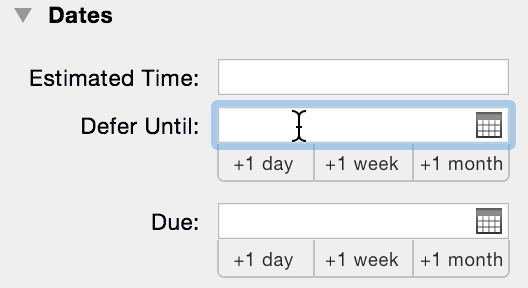
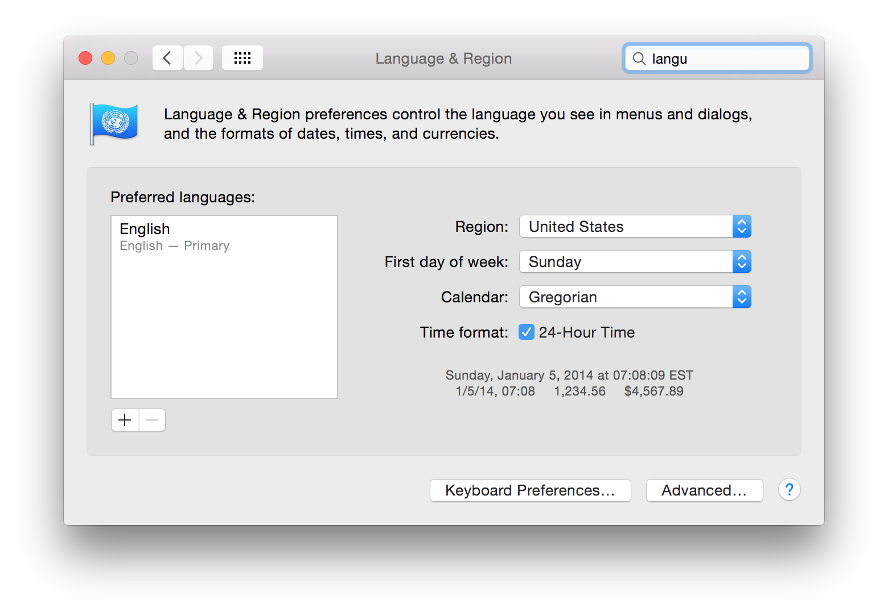

Entering “12/15 8pm” today — December 8, 2014” — in a date field like Defer or Due date results in the date “12/15/08 6pm”. This seems like a date parsing bug, since usually I am able to enter shorthand dates like that.

## Auto reply

Your message has been assigned an ID of [OG #1277565].

## Human reply

Hi Chris,

Thank for getting in touch about OmniFocus - I’d be happy to look into this behavior with you! However, entering “12/15 8pm” in a date field in OmniFocus on my Mac behaves as expected. Could you send in a screenshot of your Mac’s Language & Region System Preferences? If a custom region is selected here, it would be helpful if you could send in a screenshot of the “Advanced” settings as well. To take a screenshot on your Mac, hold down the Command and Shift keys and press 4. Your cursor will turn into crosshairs you can use to select whatever portion of your display you’d like to capture in a screenshot. After it has been taken, the screenshot should be automatically saved to your desktop.

Thanks!

Ainsley B.
Support Human
The Omni Group

## My reply

Hi Ainsley,

I have nothing custom set in the Language & Region preference. I attached a screenshot of that and an animated GIF showing the problem.

Chris

## Human reply

Hi Chris,

Thanks for following up with that info! Could you check to see if quitting and relaunching OmniFocus has any affect on the issue? I’ve set my Mac’s Date & Region Preferences to match yours, and I’m still unable to reproduce the issue on my Mac.

We were also wondering if you used a utility to create the animated gif you sent in illustrating the issue on your Mac - it’s a pretty affective way of communicating app behavior!

Sincerely,

Ainsley B.
Support Human
The Omni Group

## My reply

Hi Ainsley,

Quitting and relaunching OmniFocus has no effect on the issue; and rebooting my Mac has no effect on it either.

For that GIF, I captured a movie using QuickTime’s screen recorder (http://support.apple.com/en-us/HT201066), then turned it into a GIF with GIF Brewery (http://gifbrewery.com). That’s a fiddly way to do it; a simpler, free choice which you could use is LICEcap: http://www.cockos.com/licecap/.

Thanks,
Chris

## My reply

A few more notes…

- It turns out this only happens in the Inspector view, not when editing an action in the “central” view. (See attached GIF.)
- Turning off 24-hour time in Language & Region has no effect on this behavior.
- This is also reproducible on my coworker’s Mac.

Chris

## Human reply, 2014-12-18

Hi Chris,

Thanks for following up with that information - sorry for the delay getting back to you! I can reproduce this behavior in the Inspector on my Mac as well (I was previously testing this issue in the action outline). I’ve filed a bug report in our development database and attached your email and screenshots. Hopefully we can address this issue in an upcoming update! For the time being though, I’m sorry for any inconvenience this date parsing behavior causes you.

If you have any other questions or suggestions, please don't hesitate to contact me! And thanks for sending along info about creating screencast gifs - we’re always looking for new ways to share troubleshooting information with customers.

Sincerely,

Ainsley B.
Support Human
The Omni Group

## My reply, 2015-09-09

Hi Ainsley,

This bug is still affecting me, 9 months later. Any updates?

## Human reply, 2015-09-10

Hi Chris,

Thanks for getting back in touch about this behavior! While this is something we would like to hopefully address in a future OmniFocus update, we have not had a chance to yet. I’m sorry to disappoint! I’ll attach a note to our open bug report for this issue so that the OmniFocus team is aware that this bug is still actively impacting your workflow.

While I hope we can address this issue specifically in the near future, I did want to mention that we are working on a new column-based view mode in OmniFocus for Mac. I personally find that this new view mode makes it much easier to quickly enter dates in the action outline, and I rely on the Inspector less in my workflow. As this issue only affects dates entered in the OmniFocus Inspector, perhaps using the new column view will prevent you from encountering this bug as frequently? A preview image of this view is attached to this tweet, and we’re hoping to ship the finalized update containing this new view mode fairly soon:
<https://twitter.com/OmniFocus/status/638852243219836928>

## My reply, 2015-11-24

It's been almost a year since I reported this and it's still affecting me. Do you have any updates on this bug?

## Human reply, 2015-11-25

Hi Chris,

I'm sorry but we do not yet have any updates on this bug. I do sincerely apologize for the continued frustration this is causing. While we wish we were able to address every bug (and right away), we often have to prioritize issues that have the largest effect on the greatest number of our customers. This is an issue we would definitely like to fix, but to this point we've needed to direct the focus of our efforts on other fixes. 

I know this is not the answer you were hoping to hear, and I'm sorry for the inconvenience this trouble continues to cause. I can promise you we've not forgotten or overlooked this problem, and I do hope we'll be able direct our attention to this issue soon.
