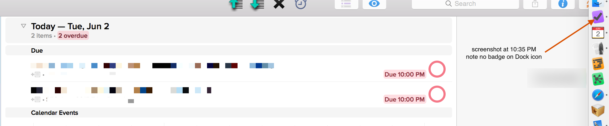
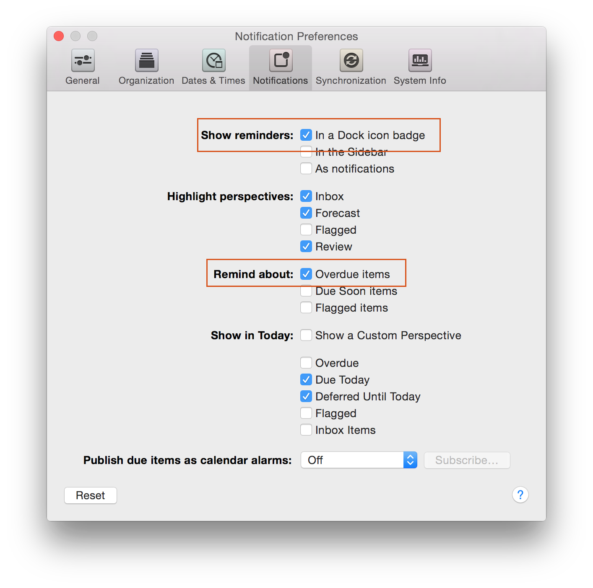

## Initial Email

**Subject:** OmniFocus not displaying circle for overdue action in red

This is in re: these tweets:

https://twitter.com/OmniFocus/status/605495004677599232

https://twitter.com/cdzombak/status/605378543154020353 (includes screenshot)

https://twitter.com/cdzombak/status/605440547709329408 (includes screenshot)

I’ve seen this on my iPhone app, running OmniFocus Pro 2.5.3 Universal, several times: an overdue action’s circle is still shown yellow(/orange), not red.

Chris Dzombak

## Auto Reply

…
Your message has been assigned an ID of [OG #1377899].
…

## Human Reply

Hi Chris,

Sorry again for the trouble here — thanks for following up with us via email!

Do you use OmniFocus with a Mac or iPad, and if so does this issue occur with these devices too? Also, can you send us a screenshot with the details for one of the actions that is still showing a yellow status circle, when it appears it should be red?

Thanks!

## My Reply

Hi,

I don’t have a screenshot right now, but I have noticed a similar issue on my Mac (OF Professional; Product: OmniFocus-MacAppStore-2.2.x Tag: OmniFocus/2.2/GM-v96.2), where something overdue isn’t displayed as such.

I also noticed this last night, where overdue actions appear as such but the Dock icon isn’t updated:

Chris

## Human Reply

Hi Chris,

We do have a bug filed for an issue with the badge count in the dock not staying up-to-date on the Mac. Please also double-check though that the "Badge app icon" option is enable for OmniFocus in System Preferences > Notifications.

While I haven't been able to reproduce your original issue myself, I will file a separate bug report on this, so our development team can investigate. 

Would it be possible for you to also send along an anonymized copy of your OmniFocus database to help us as we try reproducing the issue here?  To do so, select Help > Anonymize Database… in the OmniFocus menu bar. This will create a copy of your OmniFocus database, replacing all of the text in your database with “Xxxxx” strings. 

Thanks for your patience here!

## My Reply

Thank you for following up. “Badge App Icon” is enabled for OF.

I have attached an anonymized, zipped copy of my database.

Thanks,
Chris

## Human Reply

Thanks for sending your anonymized database. Hopefully, this can help us identify what's the issue here. If you notice anything yourself that seems like it may be related to the issue with your iPhone not showing the proper Overdue/Due Soon status, please don't hesitate to let me know. In the meantime, sorry for any inconvenience these issues cause you!
