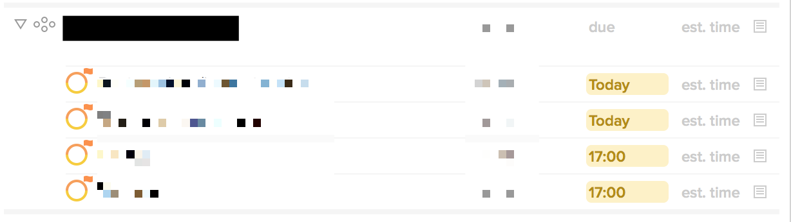

## Initial Email

**Subject:** OmniFocus 2.4.1 (v103.10 Mac App Store — Pro Edition) Feedback

In the attached screenshot, each of the 4 actions is due at the exact same time—in fact, I just set that time by selecting them all and typing “today” in the Inspector’s due date view.

Why do two actions appear in the Outline as due at “17:00” while others appear as due “Today”?

This is in a custom, project-grouped perspective.

I have attached an anonymized copy of my database.

Thanks,
Chris

## Auto reply

Your message has been assigned an ID of [OG #1530300].

## Human reply

Hi Chris,

Thanks for contacting us about this issue! Did you leave OmniFocus running thru midnight last night? If so, does closing and reopening the Perspective window fix the discrepancy? 

We have an existing bug report filed about this issue and it looks like it's related to a bug about how OmniFocus parses natural language into dates/times, but it's been difficult to reproduce so far. I've added your notes and database to the bug for the OmniFocus team to investigate.

Please let us know if you have any other questions or issues. We really appreciate it!

Sincerely,

## My reply,

Hi,

> Did you leave OmniFocus running thru midnight last night? If so, does closing and reopening the Perspective window fix the discrepancy?

Yes, and yes, that seems to fix it.

Thanks for the information!
Chris
