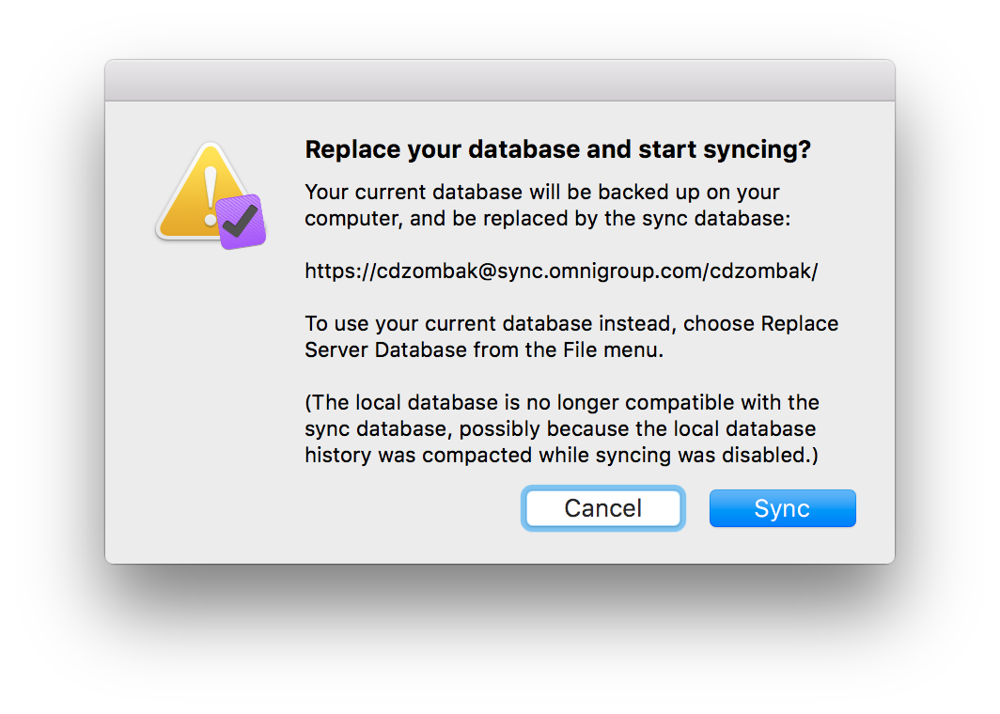

## Initial Email

**Subject:** Sync error: OmniFocus 2.4.1 (v103.10 Mac App Store — Pro Edition)

I had just made some changes in OmniFocus on my iPad and iPhone, then switched back to my computer after a moment and saw that OmniFocus on OS X had opened the attached dialog.

I have simply quit the OmniFocus application on OS X for now.

Please advise how to resolve this with no data loss.

Dialog Text:

> Replace your database and start syncing?
> 
> Your current database will be backed up on your computer, and be replaced by the sync database:
> 
> https://cdzombak@sync.omnigroup.com/cdzombak/
> 
> To use your current database instead, choose Replace Server Database from the File menu.
> 
> (The local database is no longer compatible with the sync database, possibly because the local database history was compacted while syncing was disabled.)

## Auto Reply

Your message has been assigned an ID of [OG #1530332].

## Human Reply

Hello,

Thank you for contacting us; I'm sorry for the trouble here! I think it might help here if I back up a little and explain a bit about how OmniFocus syncs. When you use more than one device with OmniFocus, those devices register with the sync database as a client. Each change that is made from any device is stored as a zip file until all the devices have had a chance to incorporate that change into their local database. If a client gets really far behind, that causes a lot of zip files to build up and slows down the whole process. In oder to accommodate for people upgrading to new devices or for whatever other reason they no longer have that device- OmniFocus will automatically drop that device from the client list after about 3 weeks so that the rest of the clients don't have to keep building up those zip files and waiting for it to synchronize.  

In this case, the database on this Mac is no longer associated with the database on your server account. The Mac version of OmniFocus is able to write a backup prior to downloading the database from the server. Since you mention you've just made changes on your iOS devices, I would recommend allowing the Mac to sync those down. Then you can open the backup it will write and compare the two windows side by side, using the 'Changed' perspective to help see what's recently been altered. 

To open that backup select "Show backups…" from the "File" menu. That should open a window pointing you to where your backups are. There should be one titled "OmniFocus prior to resynchronization on…" it will probably be near the bottom of the list of backups and should be your most recent information prior to syncing with your other device. 

I hope that helps. If you have any other questions or suggestions, please don't hesitate to contact me. We really appreciate your support!

## My Reply

Hi April,

Thanks for getting in touch with me!

> If a client gets really far behind, that causes a lot of zip files to build up and slows down the whole process. In oder to accommodate for people upgrading to new devices or for whatever other reason they no longer have that device- OmniFocus will automatically drop that device from the client list after about 3 weeks so that the rest of the clients don't have to keep building up those zip files and waiting for it to synchronize.  
> 
> In this case, the database on this Mac is no longer associated with the database on your server account.

I’m still curious how this could’ve happened in my case—I use OmniFocus [quite heavily][1], and this morning before the error my Mac was no more than a few minutes—very definitely not 3 weeks—behind my iPhone and iPad. That’s what worries me; I don’t know how the Mac became no longer associated.

[1]: https://twitter.com/cdzombak/status/693875138756935680

I will go ahead and tell the Mac to replace its database with the server version, and I’ll use your procedure to ensure no changes from my Mac from this morning were dropped.

But I’m still worried there is some underlying bug that caused this in the first place.

Over the past several days I’ve gotten a few messages on both Mac and iOS about “disconnected root transactions,” but each time I just selected “repair” which seemed to work. Is it possible that that is related, too?

Chris

## Human reply

Hey Chris,

It's definitely possible that was related. Seeing the sync logs normally give us a better indication of what's going on there. If you'd like to just reset your sync database and create a new 'root' transaction (clearing out anything that might be disconnected) here's how to do that:

Working from your Mac version of OmniFocus:

1. In OmniFocus click on File > Export and change the file format to OmniFocus Document. 
2. Save that to your desktop or somewhere you'll remember easily.

==If you use OmniFocus 2 for Mac these steps are incorrect- skip down to the alternate steps: 

3. In OmniFocus click on File > Revert to Database Backup
4. Navigate to that exported file from step 2 and proceed through the prompts to make that your live file.
5. If the sync dialog comes up, cancel it.
6. In OmniFocus menu bar click on File > Replace Server Database. 

==Alternate steps for version 2 on the Mac:

3. Find the file that was exported from step 2 and rename it to OmniFocus.ofocus-backup
4. Double click that file to open it
5. Click the button in the upper right that says "Revert to this backup" (follow the prompts to revert.)
6. If the sync dialog comes up, cancel that.
7. In the OmniFocus menu bar click File > Replace Server Database. 

Now when your other devices attempt to sync you should see a warning telling you that the databases are incompatible. On an iOS device you'll have the option to "Keep Sync Database", go ahead and choose that one. On another Mac version it will automatically take the sync database and backup the old one.

Let me know if there's anything more I can do!

Sincerely,

## My reply

Hi April,

I've already replaced the database on my Mac with the server version; I will certainly try those instructions next time I get a "disconnected toor transaction" error.

> Seeing the sync logs normally give us a better indication of what's going on there.

How can I send those to you for debugging?

Thanks,
Chris

## Human Reply, 201-02-05

Hey Chris,

Unfortunately the console logs on iOS devices don't hang around very long, but if this happens again here's the instructions for getting a console log from your device: <http://www.omnigroup.com/support/ios-console-log>

Again, sorry for all the trouble and thank you for all your patience and understanding here! Please let me know if there's anything more I can do!

Sincerely,
