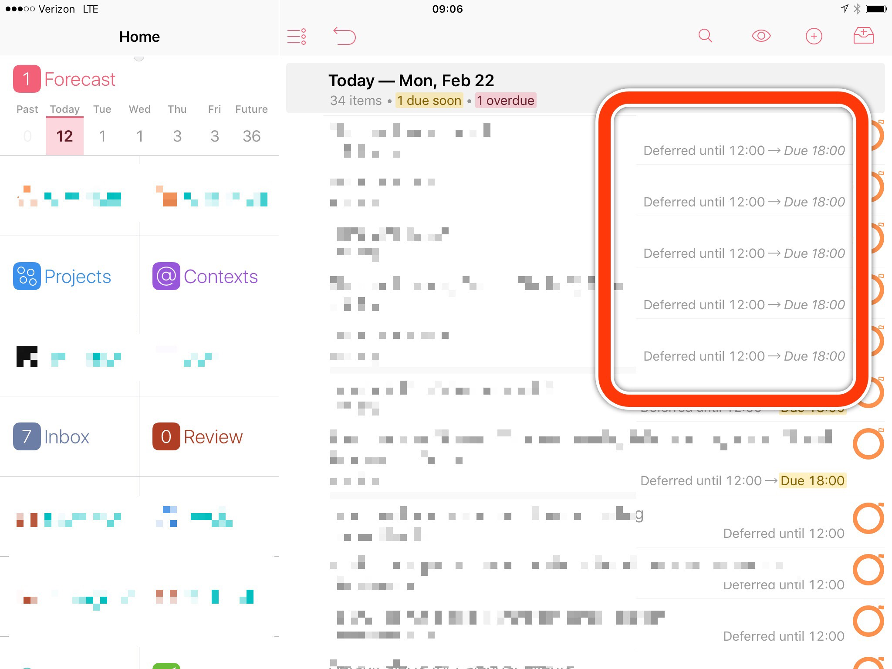
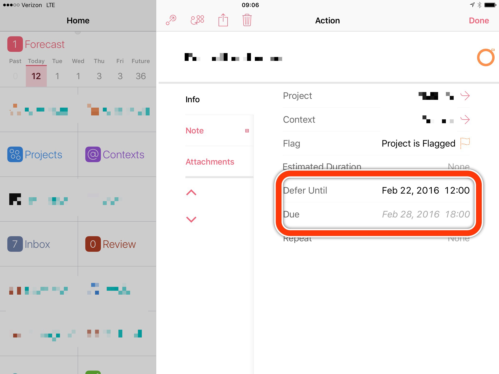
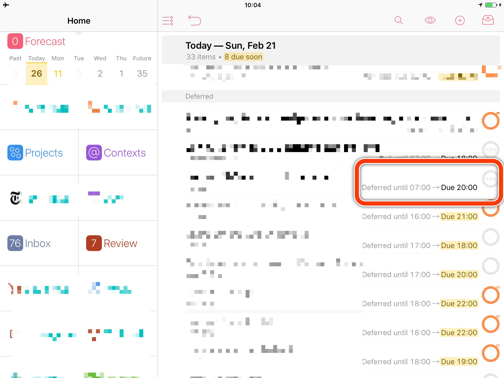
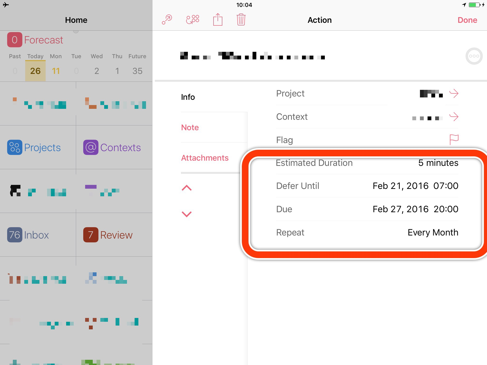

## Initial Email

**Subject:** Actions deferred to today but due in the future show as due today

In OmniFocus 2.11 Universal [Pro] for iOS, I have encountered a date display bug in the Forecast view.

I noticed this on many actions deferred to today’s date, but due on a date in the future. The deferred time—like “7:00”—is displayed as expected. But rather than showing “Due [FUTURE DATE]” it shows something like “Due 20:00”, making it look like the action is due today.

Looking at the action’s details, it is clear it’s actually due on a future date.

I’ve attached screenshots which should help clarify this bug.

Thanks,
Chris Dzombak









## Auto Reply

```
This is the mail system at host omnigroup.com.

I'm sorry to have to inform you that your message could not
be delivered to one or more recipients. It's attached below.

For further assistance, please send mail to postmaster.

If you do so, please include this problem report. You can
delete your own text from the attached returned message.

                  The mail system

<omnifocus@omnigroup.com>: Command died with status 1: "/usr/local/bin/procmail
   -a omnifocus /usr/local/lib/procmail/supportmail". Command output: Sorry,
   but your message appears to be unsolicited commercial e-mail, and has
   therefore been automatically rejected by our e-mail delivery software.  If
   you feel your message was rejected in error, please contact The Omni Group
   at postmaster@omnigroup.com or +1 206 523 4152.   
```

## [My tweet](https://twitter.com/cdzombak/status/701879627824939009)

@OmniFocus @OmniGroup I tried sending this bug report to OF support but it was bounced as spam. Please help? https://t.co/eokBB5jwAh

## [@OmniFocus Reply](https://twitter.com/OmniFocus/status/701914516452302848)

@cdzombak Sorry about the bounce; has that happened before? We have an open report about the Forecast behavior, as well; adding your info!

## [My Reply](https://twitter.com/cdzombak/status/701948854086795264)

@OmniFocus no, that hasn’t happened before. Just to be sure: should I try to re-send, then, or has my report been noted?

## [@OmniFocus reply](https://twitter.com/OmniFocus/status/702213523636510721)

@cdzombak The person working the account yesterday isn’t accessible @ the moment, but will make sure this gets filed. Better 2 times than 0.

## [@OmniFocus reply](https://twitter.com/OmniFocus/status/702214392176193536)

@cdzombak Looking @ s’shot, was ‘due today’ time inherited from the action group or project the rows belonged to? (Yellow, just below them.)

## [My reply](https://twitter.com/cdzombak/status/702227638681792513)

@OmniFocus In one case, due time was inherited from the parent project; in another case, due time was assigned to the specific action

## [@OmniFocus reply](https://twitter.com/OmniFocus/status/702277137634439168)

@cdzombak In ambiguous cases, OmniFocus picks the earliest date it can find, since real-world consequences are likely to be lesser.

## My reply

[1/2](https://twitter.com/cdzombak/status/702509420983545856): @OmniFocus understood, but this is *not* ambiguous… (1/2)

[2/2](https://twitter.com/cdzombak/status/702509739691909120): @OmniFocus …items w/no due date, inheriting future due date from parent project, shouldn't be displayed "Due 18:00", but instd "Due Feb. 28"
