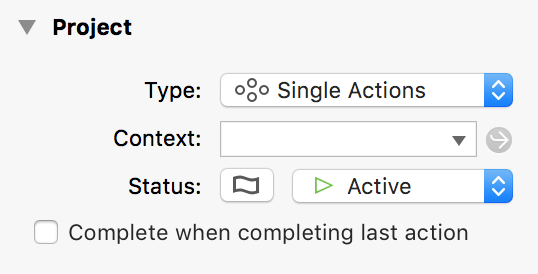
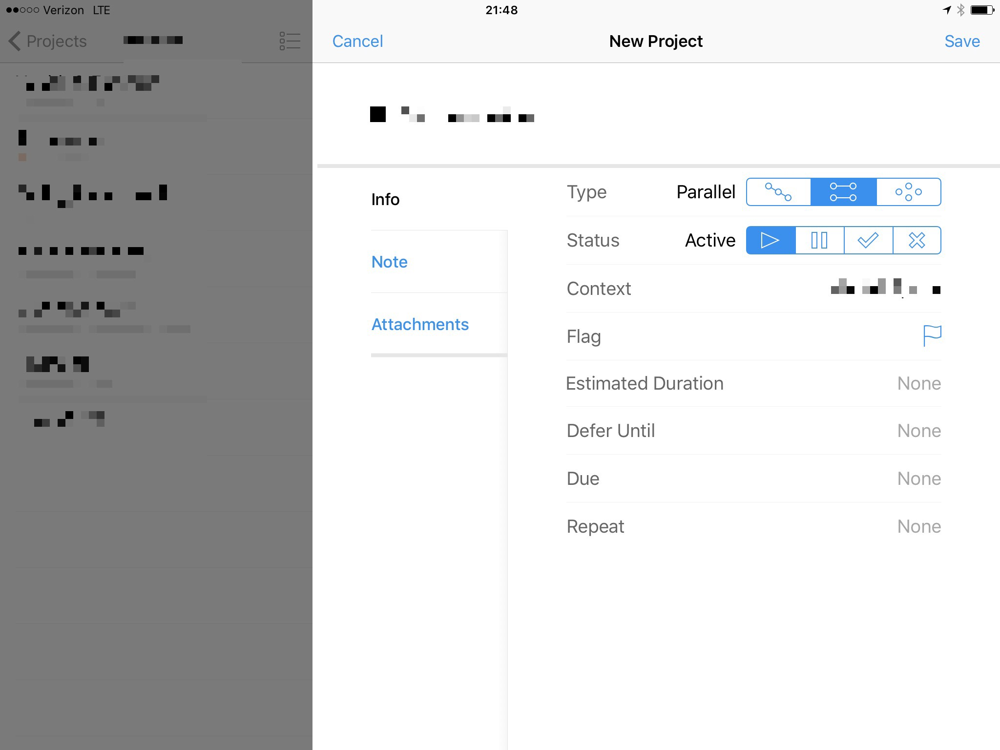

## Initial Email

**Subject:** Allow setting “Complete when completing last action” on iOS

In OmniFocus on OS X, it is possible to set a project to “complete when completing last action”. I use this quite heavily.

When working on my iPad, I miss this: either it’s not possible or it doesn’t show in the expanded project view, where I would expect it to.

This is one of very few features from the desktop version that I’m missing on iOS.

Please add this on iOS.

Thanks,
Chris Dzombak

## Auto Reply

Your message has been assigned an ID of [OG #1539268].

## Human Reply

Hi Chris, thanks for contacting us! Sorry for the trouble here.

While the iOS version of OmniFocus 2 doesn't offer the setting you describe to change whether or not a project is marked complete when completing the last action, this preference does sync from OmniFocus 2 for Mac. If you change this setting on any of your projects from the Mac app and sync, the behavior will carry over to the iPad.

I'll let the team know you'd like to see a way to control this setting on the iOS devices as well. We can't work in every feature that our users suggest, but we really appreciate them, and we can promise that each suggestion will be read and considered. Thanks for letting us know that'd benefit your use!

If you need any additional assistance, or if you have any other questions or suggestions, please don't hesitate to get in touch. We really appreciate your support!

## My Reply

Thanks for the reply. I know I can set it on my Mac and the behavior will sync to iOS, which is helpful.

My specific use case here is that I was on a 2-week vacation with no Mac—only iPhone and iPad, and I created a few projects which needed to have this set.

OF on iPad now has very close parity to the OS X version, which I love. This oversight was disappointing to discover (again, when I was away from my Mac for a long period of time).

Thanks,
Chris
