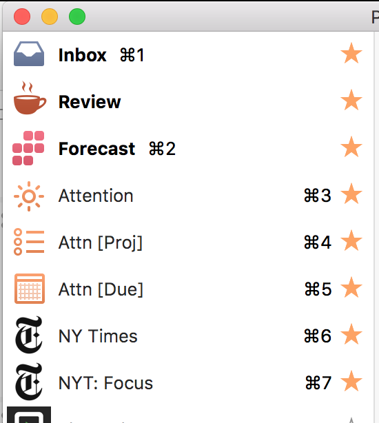

## Initial Email

**Subject:** OmniFocus 2.4.2 (v103.12 Mac App Store — Pro Edition) Feedback

In the Perspectives window’s list of perspectives, the keyboard shortcuts assigned to my custom perspectives are displayed right-aligned, next to the star icon.

But built in perspectives (Inbox, Forecast) show the keyboard shortcut left-aligned. (See screenshot attached, illustrating this.)

This makes quickly visually scanning for assigned shortcuts quite difficult. I think all the shortcuts used to be right-aligned in some previous versions.

Thanks,
Chris Dzombak

## Auto Reply

Your message has been assigned an ID of [OG #1539740].

## Human Reply

Chris-
Wow. In all my years of staring at OmniFocus, how did I never notice that? Good eye for detail and thank you very much for sending this in; will file this as a bug right away!

Sincerely,

## Human Reply

Chris-
Good news! In going to write up the bug, it turns out this is actually a new issue which should be fixed in an upcoming release. Hope that helps.

Sincerely,

## My Reply

Great; thanks for the info!

Chris
