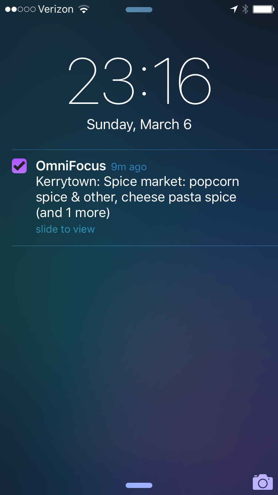

## Initial Email

**Subject:** OmniFocus 2.4.2 (v103.12 Mac App Store — Pro Edition) Feature Request

It would be useful to attach "actionable hours" to contexts. Then, actions in that context would only be considered "available" during those hours each day.

I can imagine many cases where a context is only actionable during business hours or evening hours, for example, but my main reason for this request is related to geofence alerts.

In cases like the attached screenshot, it does not make sense for me to be alerted to actions at local shops if I'm driving home late at night, after the shops have closed.

Ideally, in addition to assigning a location to this context, I could make it actionable only from 8am-8pm each day.

Thanks,
Chris Dzombak

## Auto Reply

Your message has been assigned an ID of [OG #1547265].
