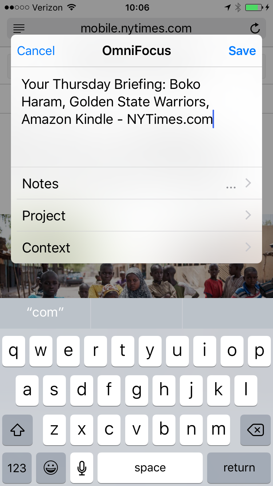

## Initial Email

**Subject:** OmniFocus 2.13.1 Universal Pro (v107.4.0.258468) Feedback

The way I use OmniFocus, it would be immensely useful to be able to flag items as they’re added from the iOS share sheet:

## Auto Reply

Your message has been assigned an ID of [OG #1560179].

## Human Reply

Hi Chris, thanks for contacting us!

As you can imagine, you wouldn't be the first to ask for this addition — it looks like there's an existing feature request to add a way to flag from the share extension in a future release, so I've let the rest of the team know you'd like to see this, too. We can't work in every feature that our users suggest, but we really appreciate them, and we can promise that each suggestion will be read and considered. Thanks for letting us know that'd benefit your use!

If you need any additional assistance, or if you have any other questions or suggestions, please don't hesitate to get in touch. We really appreciate your support!
