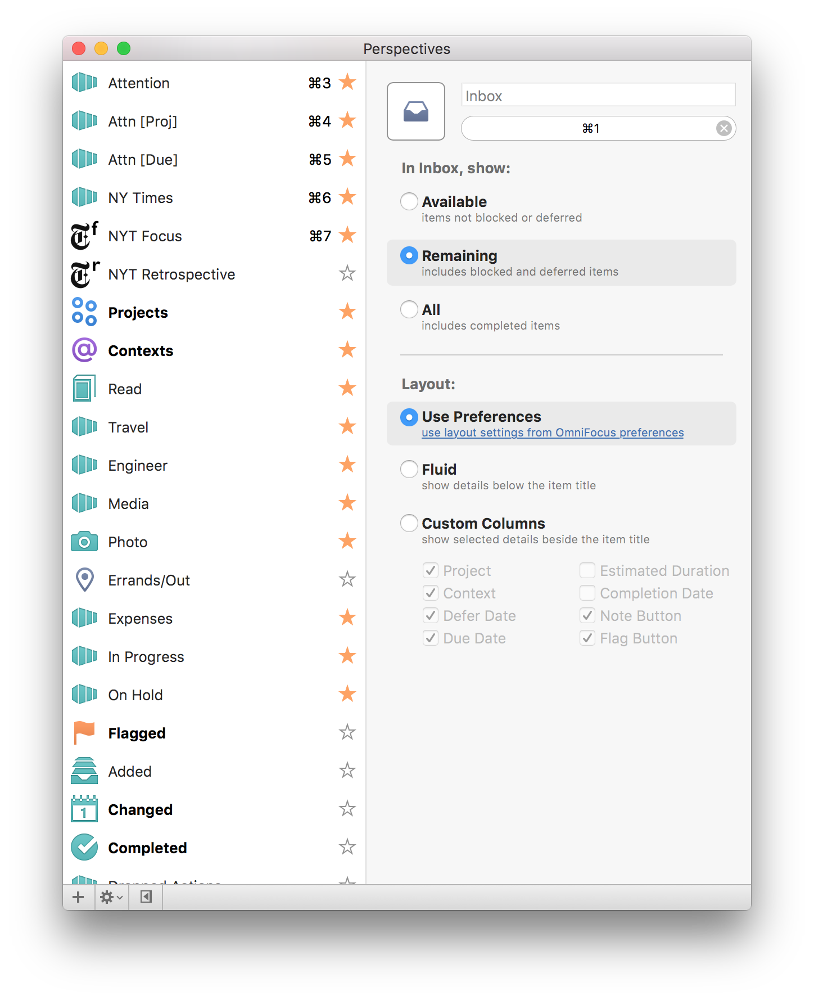
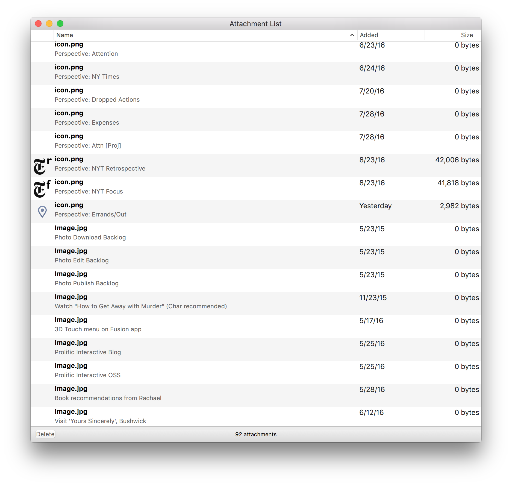

## Initial Tweets

<blockquote class="twitter-tweet" data-lang="en">
<a href="https://twitter.com/OmniFocus">@OmniFocus</a> my custom perspective icons have been slowly disappearing for the last several days. <a href="https://t.co/69C48da084">pic.twitter.com/69C48da084</a>
&mdash; Chris Dzombak (@cdzombak) <a href="https://twitter.com/cdzombak/status/768810053235122176">August 25, 2016</a></blockquote> 

<blockquote class="twitter-tweet" data-conversation="none" data-lang="en">
<a href="https://twitter.com/OmniFocus">@OmniFocus</a> actually, it appears that many (most) of my attachments are missing!! <a href="https://t.co/zekHEe6hea">pic.twitter.com/zekHEe6hea</a>
&mdash; Chris Dzombak (@cdzombak) <a href="https://twitter.com/cdzombak/status/768810387881889793">August 25, 2016</a></blockquote> 

## Initial Email

**Subject:** URGENT: DATA LOSS OmniFocus 2.6.1 (v109.3.6 Mac App Store — Pro Edition)

I’m using the latest version of OmniFocus from the Mac and iOS App Stores and have migrated my database to the new format allowing for e2e encryption.

Starting a few days ago, I noticed my custom perspective icons started going missing (screenshot attached). I re-added a few of them but stopped once I realized what was going on. I checked today and it appears that the majority of my attachments are missing (screenshot attached).

What’s going on? Where are my attachments?

It should go without saying that I need to be able to trust OmniFocus, and an incident like this is — to put it lightly — extremely disconcerting and disappointing.

## Auto Reply

Your message has been assigned an ID of [OG #1626010].

## Urgent

I forwarded the autoresponse to urgent@omnigroup since this issue represents data loss.

## My Reply

An update: the Mac App Store isn’t offering me the 2.6.2 update.

## My Reply

I updated to 2.6.2 (v109.3.9) and my attachments are still missing.

## Human Reply

_Waiting on a response._

